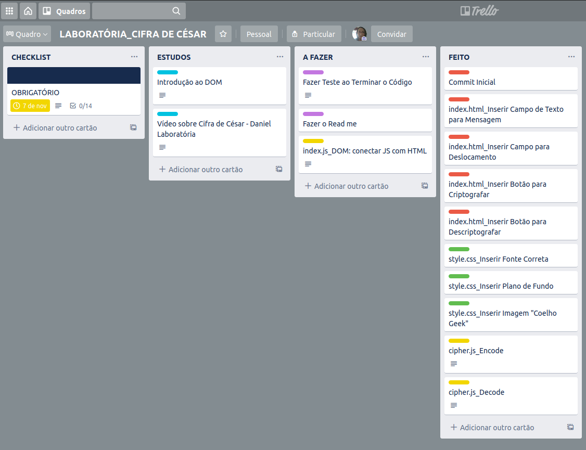

# Enigma do Nerd  :exclamation::question:
Desenvolvido para ajudar os nerds a conseguir descontos secretos na loja

## Índice

* [1. Introdução](#1-introdução)
* [2. Desenvolvimento](#2-desenvolvimento)
* [3. Ferramentas](#3-ferramentas)

***

## 1. Introdução

Primeira aplicação web do _bootcamp_ da [Laboratória] (https://www.laboratoria.la/br), desenvolvida por mim. 
A proposta é utilizar a cifra de César onde o usuário pode cifrar e decifrar um texto.

A [cifra de César] (https://pt.wikipedia.org/wiki/Cifra_de_C%C3%A9sar) é uma das técnicas mais simples de cifrar uma mensagem. É um
tipo de cifra por substituição, em que cada letra do texto original é
substituida por outra que se encontra há um número fixo de posições
(deslocamento) mais a frente do mesmo alfabeto.

## 2. Desenvolvimento
  ###  :heavy_check_mark: Tema

Com a comodidade de comprar um produto sem sair do lugar, as compras on-line tem tido
um crescimento cada vez maior. [Estudos] (https://www.ecommercebrasil.com.br/artigos/a-covid-19-e-a-transformacao-do-comercio-eletronico-no-brasil/) mostram que durante o período de pandemia no
Brasil, 4 em cada 5 brasileiros realizaram alguma compra online. 

Inspirada na maior temporada de descontos do ano, escolhi um tema que seria destinado
à pessoas afixionadas pela cultura geek. Juntando a satisfação de comprar com o desafio de
solucionar um enigma (que todo bom nerd gosta! :video_game:) que resultará em um desconto ainda
maior do produto. 

A idéia aqui seria o usúario escolher um produto, encontrar a palavra escondida pelo site e digitar
ela na interface inicial da página para ganhar +20 de desconto.

  ##  :heavy_check_mark: Interface

O objetivo principal foi oferecer uma interface simples e ao mesmo tempo chamativa, com cores vibrantres.

##  :heavy_check_mark: Planejamento

Para o planejamento do projeto, utilizei o modelo Kanban do [Trello] (https://trello.com).

## 3. Ferramentas

* HTML
* CSS
* Vanilla JavaScript

